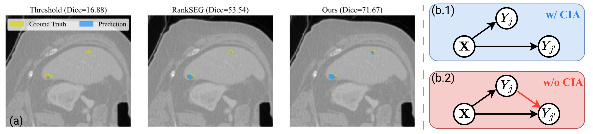

<h1 align="center"> <em>On the Relaxation of Conditional Independence Assumption for Image Segmentation</em></h1>

<p align="center">
  Zixun Wang, Ben Dai &nbsp;·&nbsp; The Chinese University of Hong Kong &nbsp;·&nbsp; <b>NeurIPS 2026</b>
</p>



*(a) On a low-contrast liver-tumor slice, thresholding barely detects the tumor, and CIA-based RankSEG misses the upper-right lesion. Our method recovers it by using label dependence inside the tumor region. (b) Under the conditional independence assumption (CIA), each label Y<sub>j′</sub> is predicted from the image <b>X</b> alone. Without CIA, the neighboring label Y<sub>j</sub> also informs the prediction.*

## Highlights

In semantic segmentation, most methods estimate pixel-wise class probabilities and then apply *argmax* or *thresholding* to get the final mask. RankSEG (Dai & Li, 2023; Wang & Dai, 2025) showed that this is suboptimal for Dice/IoU. It proposed a training-free inference rule that optimizes these metrics directly. However, RankSEG relies on the **Conditional Independence Assumption (CIA)**, which treats pixel labels as independent given the image. CIA discards useful label correlations, and this hurts most in ambiguous or low-contrast regions. Modeling full label dependence would solve this, but it costs $\mathcal{O}(d^3)$ for $d$ pixels.

In this work, we:

- **Relax CIA to Spatially Localized Dependence (SLD)**, which captures correlations between nearby labels.
- **Keep inference at $\mathcal{O}(d \log d)$** with a Reciprocal Moment Approximation and a fixed-point optimization.
- **Outperform argmax and CIA-RankSEG** on every dataset and model we tested, especially on low-contrast images and small objects.

## Usage

The algorithm is implemented in [`exp/rankseg_dep.py`](exp/rankseg_dep.py). It takes a probability map as input and returns a segmentation mask, so it can replace `argmax` with one line of code. The model and training stay unchanged.

```python
# prob: [batch_size, num_classes, height, width], softmax probabilities
# Existing method: pred = prob.argmax(dim=1)

from rankseg_dep import rankseg_dep
pred = rankseg_dep(prob)
```

## Experiments

### Data Preparation

See [exp/DATA.md](exp/DATA.md) for instructions on preparing the datasets: ADE20K, Cityscapes, DeepGlobe Land, LiTS and KiTS.

### Training and Evaluations

```bash
cd exp

# Step 1: Train a model with cross-entropy loss and evaluate with standard `argmax` prediction
torchrun \
    --nnodes=1 --nproc_per_node=1 --node_rank=0 --master_port=12345 \
    main.py \
        --data_dir "/path/to/data" \
        --output_dir "/path/to/output" \
        --model_yaml "upernet_convnext_base.fb_in22k_ft_in1k_384" \
        --data_yaml "ade20k" \
        --loss_yaml "ce" \
        --schedule_yaml "80k_iters" \
        --optim_yaml "adamw_lr6e-5" \
        --test_yaml "test_iou" \
        --predict_yaml "argmax"

# Step 2: Re-evaluate the trained model with `rankseg_dep` prediction
python main.py \
    --data_dir "/path/to/data" \
    --output_dir "/path/to/output" \
    --model_yaml "upernet_convnext_base.fb_in22k_ft_in1k_384" \
    --data_yaml "ade20k" \
    --loss_yaml "ce" \
    --schedule_yaml "80k_iters" \
    --optim_yaml "adamw_lr6e-5" \
    --test_yaml "test_iou" \
    --predict_yaml "rankseg_dep" \
    --test-only
```

The baselines use the other configs in [`exp/configs/predict`](exp/configs/predict): `argmax`, `rankseg_rma` (CIA-RankSEG), `dense_crf` and `conv_crf`. To run them, change `--predict_yaml` in Step 2.

### Performance Comparison

We report image-wise Dice (%) below; mIoU results are in the paper. **Ours** is SLD-based RankSEG. **CIA-RankSEG** is [RankSEG-RMA](https://github.com/ZixunWang/RankSEG-RMA).

#### Medical Datasets (low contrast)

| Model | Prediction | KiTS | LiTS |
| --- | --- | --- | --- |
| UNet | Argmax | 57.36 | 47.58 |
| UNet | CIA-RankSEG | 60.07 | 50.07 |
| UNet | **Ours** | **60.48** | **50.16** |
| DeepLabV3+ | Argmax | 61.16 | 47.38 |
| DeepLabV3+ | CIA-RankSEG | 63.56 | 49.50 |
| DeepLabV3+ | **Ours** | **64.07** | **49.88** |

#### Natural and Remote-Sensing Datasets

| Model | Prediction | ADE20K | Cityscapes | DeepGlobe |
| --- | --- | --- | --- | --- |
| PSPNet | Argmax | 58.66 | 80.45 | 66.23 |
| PSPNet | CIA-RankSEG | 59.17 | 81.14 | 67.82 |
| PSPNet | **Ours** | **59.49** | **81.27** | **68.14** |
| DeepLabV3+ | Argmax | 59.57 | 80.59 | 66.73 |
| DeepLabV3+ | CIA-RankSEG | 59.95 | 81.24 | 67.94 |
| DeepLabV3+ | **Ours** | **60.27** | **81.42** | **68.27** |
| SegFormer | Argmax | 61.03 | 80.53 | 68.74 |
| SegFormer | CIA-RankSEG | 61.92 | 81.38 | 70.14 |
| SegFormer | **Ours** | **62.23** | **81.51** | **70.42** |
| UPerNet | Argmax | 63.98 | 82.61 | 68.60 |
| UPerNet | CIA-RankSEG | 64.92 | 83.21 | 69.57 |
| UPerNet | **Ours** | **65.19** | **83.31** | **69.91** |

*Our method outperforms both Argmax and CIA-RankSEG across all models and datasets.*
